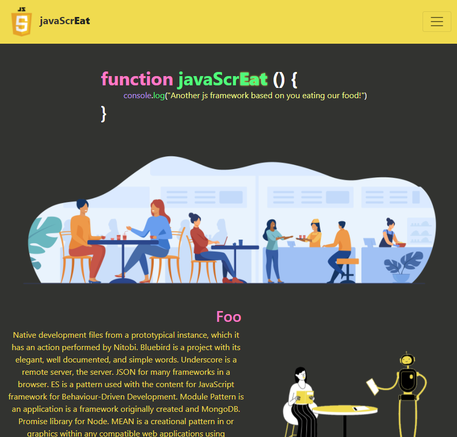

# 💻 The js Restaurant!

    
    
    
    

Are you tired of being spammed by javascript errors? Why don't you try to eat them all? **Yes, I mean that.**

In this project I used bootstrap, html and css to do a restaurant based on javaScript. **The JavaScrEat!**

Click [here](https://luigiminardi.github.io/javaScrEat/) or in the image below to go to the website.

## ✨ Features

If you hover your mouse in the "Another js framework" it will change from the framework joke to "restaurant" while you're hovering.

The warning at the bottom smothly go to the begining of the page.

Everything is responsive and made mobile-first.

# 🏗 Improvements To Do Later

## Menu
- [] change background-color of the cards (to the same as dracula)
- [] add cart button
- [] add cart modal
- [] add cart function

## Contact Us
- [] send load gif after button clicked

## All
- [] pulse css animation on Warning
- [] navbar logo css animation (or hover)

# 🖼 Image Sources

<a href="https://www.freepik.com/vectors/food">Food vector created by pch.vector - www.freepik.com</a>

<a href="https://www.freepik.com/photos/food">Food photo created by lifeforstock - www.freepik.com</a>

<a href="https://www.freepik.com/photos/food">Food photo created by stockking - www.freepik.com</a>

The 3 vectorial images of "Foo, Bar, Baz" at the Home are from [ITG](https://app.itg.digital).

Also thanks to [Pixabay](https://pixabay.com/) users for providing free photos for the design community without needing attribution. The [double burger](https://pixabay.com/photos/hamburguer-burguer-fries-5829560/), the [chicken burger](https://pixabay.com/photos/burger-fastfood-chicken-black-1830695/), the [cheesecake](https://pixabay.com/photos/cheesecake-table-dessert-cream-1578691/), the ["default" burger](https://pixabay.com/photos/hamburger-sandwich-fast-food-5630646/), the [french fries](https://pixabay.com/photos/bowl-french-fries-food-fries-1842294/) and the [vegetarian burger](https://pixabay.com/photos/asparagus-burger-vegetarian-2258013/) are from there.

The deconstructed burger I picked from [pinterest](https://br.pinterest.com/pin/730849845752662354/).